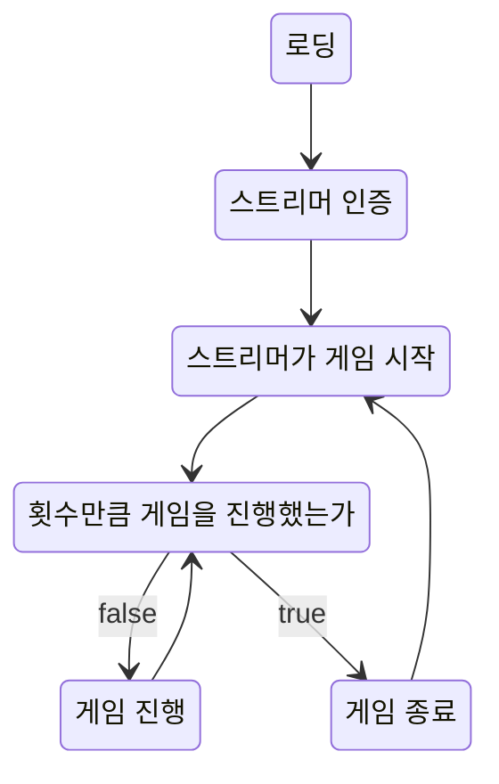

# LetsTrawing

트위치와 연동하는 그림 그리고 맞추기 게임 저장소

### Game Flow

### GitHub Secrets

- `API_KEY`: 리포지토리에 대한 접근 권한을 갖는 깃헙 PAT 토큰을 만든 뒤에 넣어주시면 됩니다.
- `CHANNEL`: 스트리머의 아이디
    - ex) `https://twitch.tv/doralife12`에서 `doralife12`
- `USERNAME`: 봇의 이름
    - 아무거나 해도 상관 없습니다.
- `PASSWORD`: https://twitchapps.com/tmi/ 에 접속한 뒤에, 자신의 트위치 계정으로 로그인을 하면 토큰이 나옵니다. 해당 토큰을 넣으면 됩니다. 아래의 형식을 따릅니다.
    - oauth:xxx