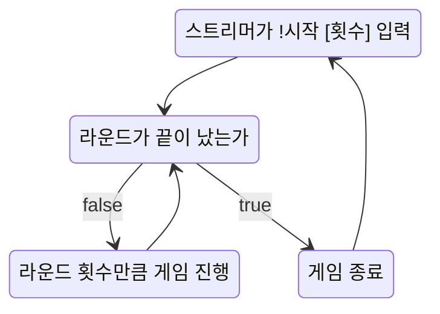

# LetsTrawing

트위치와 연동하는 그림 그리고 맞추기 게임 저장소

### Game Flow

```mermaid
stateDiagram-v2
state "스트리머가 !시작 [횟수] 입력" as s1
state "라운드가 끝이 났는가" as s2
state "라운드 횟수만큼 게임 진행" as s3
state "게임 종료" as s4

s1 --> s2
s2 --> s3: false
s3 --> s2
s2 --> s4: true
s4 --> s1
```